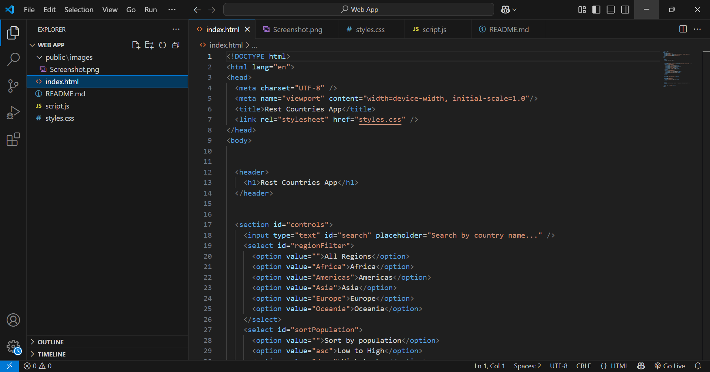

# Rest Countries App

A simple web app that fetches country data from the REST Countries API and displays it in a user-friendly format.

## 🌍 Features

- View countries as cards with:
  - Name
  - Capital
  - Region
  - Population
  - Flag
- Search by name
- Filter by region
- Sort by population (ascending & descending)
- Pagination (load more on demand)

## 🔧 Setup

1. Clone the repository:
   ```bash
   git clone https://github.com/yourusername/rest-countries-app.git
   cd rest-countries-app

## 📸 Screenshot
[](Screenshot.png)
